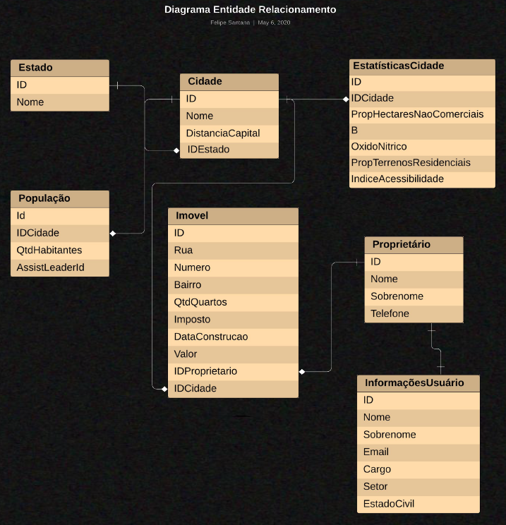
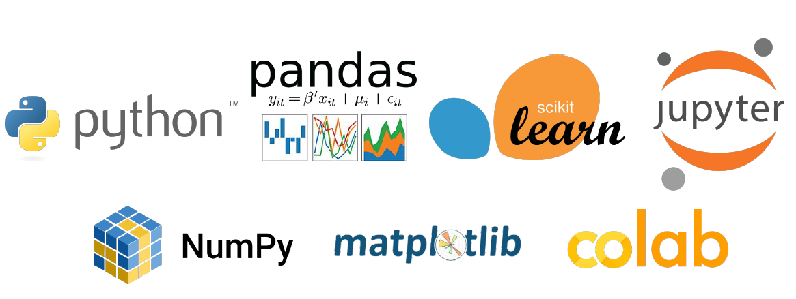

## 📌 Introdução
A equipe do [Minerando Dados](https://minerandodados.com.br/) promoveu a Semana de Data Science entre os dias 14 e 18 de setembro de 2020, um evento totalmente gratuito cujo objetivo é mostrar o que é Data Science e Machine Learning e como se tornar um profissional dessa área, ou ainda, como essa ciência e suas tecnologias estão mudando o mundo.

<h2 align="center">
    
</h2>

## 🔗 Alguns pontos abordados:
- Como grandes empresas como Uber, Netflix e Nubank utilizam essas tecnologias em seus negócios.
- Apresentação de todas etapas de um projeto começando do zero.
- Conceitos fundamentais sobre o que é Data Science?
- Como interpretar o problema e definir o baseline.
- Como configurar seu ambiente de trabalho:
    - Carregamento da base de dados.
    - Modelagem da base dados.
    - Como preparar a base de dados?
- Como executar um algoritmo de Machine Learning ?
- Avaliar os resultados encontrados.
- Desenvolvimento de um Data App.

## 👨🏻‍💻 Projeto implementado
O projeto teve como objetivo desenvolver um modelo que possa prever o valor do preço de imóveis de uma determinada cidade, essa análise é feita com base nas características de cada imóvel, a intenção é tornar o modelo mais assertivo possível.

A base de dados utilizada é muito conhecida, contém as informações da cidade de Boston nos Estados Unidos.

### 📝 Diagrama Entidade de Relacionamento
<h2 align="center">
    
</h2>

    <h3>🧩 Data App</h3>
    
O intuito é desenvolver e publicar um data app, onde apartir de informações fornecidas pelo usuário o modelo de machine learning consegue estimar o valor para um determinado imóvel, sendo esse valor mais assertivo possível. 
Buscamos refletir a realidade de acordo com a base de dados existente.

    

    <h3>📚 Ferramentas e bibliotecas utilizadas:</h3>
    

